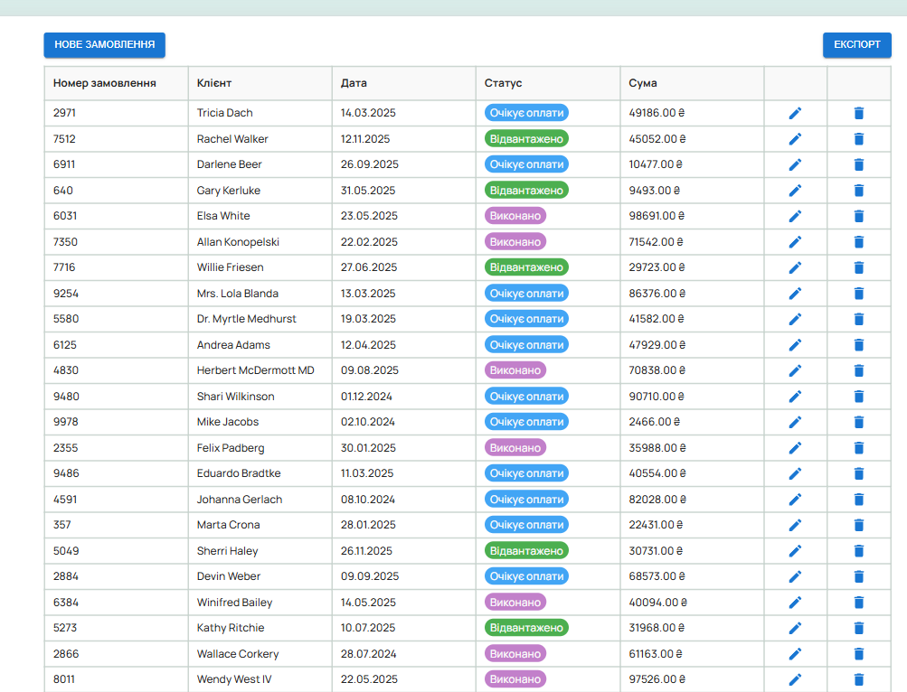

# Orders Table

## Description

Simple website with table orders by using Tanstack Tables and MUI components.

### Screenshots



## Development

1. Clone the repository.
2. Install dependencies and start the development server:

   ```bash
   npm install
   npm run dev
   ```

3. Open [http://localhost:5173](http://localhost:5173) in your browser.

## Production

1. Clone the repository.
2. Install dependencies and build for production:

   ```bash
   npm install
   npm run build
   ```

3. Preview the production build:

   ```bash
   npm run preview
   ```

4. Open [http://localhost:4173](http://localhost:4173) in your browser.

## Developer

developed by Oksana S. - Frontend Developer

---

_Happy coding and safe travels!_
